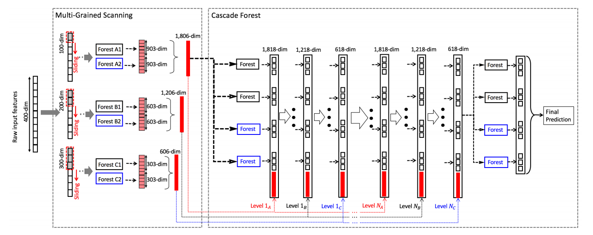

<a href="https://github.com/whatbeg/forestlayer">
<div align="center">
	
</div>
</a>

# ForestLayer

ForestLayer is an highly efficient and scalable deep forest learning library based on Ray.
It provides rich easy-to-use data processing, model training modules to help researchers and engineers build practical deep forest learning workflows.
It internally embeds task parallelization mechanism using Ray, which is a popular flexible, high-performance distributed execution framework proposed by U.C.Berkeley.
<br>ForestLayer aims to enable faster experimentation as possible and reduce the delay from idea to result.</br>
<br>Hope that ForestLayer can bring you good researches and good products.</br>

You can refer to [Deep Forest Paper](https://arxiv.org/abs/1702.08835), [Ray Project](https://github.com/ray-project/ray) to find more details.

## News

* [24 July] ForestLayer white paper is shared on [arXiv]().
* [1 Feb] Forest Splitting mechanism are supported. Now ForestLayer can achieve 2.5x speedup to gcForest v1.0 with 8 nodes.
* [10 Jan] You can now use ForestLayer for regression task or use it in your data science algorithm competitions! We recommend using small layer of cascade in regression task since it's easy to overfit the data.
* [8 Jan] You can now use ForestLayer for classification tasks. See [examples](https://github.com/whatbeg/forestlayer/tree/master/examples)


## Prerequisites

numpy, scikit-learn, keras, ray,
joblib, xgboost, psutil, matplotlib, pandas

## Installation

ForestLayer has install prerequisites including scikit-learn, keras, numpy, ray and joblib. For GPU support, CUDA and cuDNN are required, but now we have not support GPU yet. The simplest way to install ForestLayer in your python program is:
```
[for master version] pip install git+https://github.com/whatbeg/forestlayer.git
[for stable version] pip install forestlayer
```

Alternatively, you can install ForestLayer from the github source:
```
$ git clone https://github.com/whatbeg/forestlayer.git

$ cd forestlayer
$ python setup.py install
```

## What is deep forest?

<div align="center">
    
    <p><i>The architecture of deep forest. from [1]</i></p>
</div>

[1] Deep Forest: Towards An Alternative to Deep Neural Networks, by Zhi-Hua Zhou and Ji Feng. IJCAI 2017

## Getting Started: 30 seconds to ForestLayer

The core data structure of ForestLayer is layers and graph. Layers are basic modules to implement different data processing, and the graph is like a model that organize layers, the basic type of graph is a stacking of layers, and now we only support this type of graph.

Take MNIST classification task as an example.

First, we use the Keras API to load mnist data and do some pre-processing.
``` python
(x_train, y_train), (x_test, y_test) = mnist.load_data()
# TODO: preprocessing...
```

Next, we construct multi-grain scan windows and estimators every window and then initialize a `MultiGrainScanLayer`. The Window class is lies in `forestlayer.layers.window` package and the estimators are represented as `EstimatorArgument`s, which will be used later in layers to create actual estimator object.
``` python
rf1 = ExtraRandomForestConfig(min_samples_leaf=10, max_features='sqrt')
rf2 = RandomForestConfig(min_samples_leaf=10)

windows = [Window(win_x=7, win_y=7, stride_x=2, stride_y=2, pad_x=0, pad_y=0),
           Window(11, 11, 2, 2)]

est_for_windows = [[rf1, rf2], [rf1, rf2]]

mgs = MultiGrainScanLayer(windows=windows, est_for_windows=est_for_windows, n_class=10)
```

After multi-grain scan, we consider that building a pooling layer to reduce the dimension of generated feature vectors, so that reduce the computation and storage complexity and risk of overfiting.
``` python
pools = [[MaxPooling(2, 2), MaxPooling(2, 2)],
         [MaxPooling(2, 2), MaxPooling(2, 2)]]

pool = PoolingLayer(pools=pools)
```

And then we add a concat layer to concatenate the output of estimators of the same window.
``` python
concatlayer = ConcatLayer()
```

Then, we construct the cascade part of the model, we use an auto-growing cascade layer to build our deep forest model.
``` python
est_configs = [
    ExtraRandomForestConfig(),
    ExtraRandomForestConfig(),
    RandomForestConfig(),
    RandomForestConfig()
]

auto_cascade = AutoGrowingCascadeLayer(est_configs=est_configs, early_stopping_rounds=4,
                                       stop_by_test=True, n_classes=10, distribute=False)
```

Last, we construct a graph to stack these layers to make them as a complete model.
``` python
model = Graph()
model.add(mgs)
model.add(pool)
model.add(concatlayer)
model.add(auto_cascade)
```

You also can call `model.summary()` like Keras to see the appearance of the model. Summary info could be like follows table,
```
____________________________________________________________________________________________________
Layer                    Description                                                        Param #
====================================================================================================
MultiGrainScanLayer      [win/7x7, win/11x11]                                               params
                         [[FLCRF, FLRF][FLCRF, FLRF]]
____________________________________________________________________________________________________
PoolingLayer             [[maxpool/2x2, maxpool/2x2][maxpool/2x2, maxpool/2x2]]             params
____________________________________________________________________________________________________
ConcatLayer              ConcatLayer(axis=-1)                                               params
____________________________________________________________________________________________________
AutoGrowingCascadeLayer  maxlayer=0, esrounds=3                                             params
                         Each Level:
                         [FLCRF, FLCRF, FLRF, FLRF]
====================================================================================================
```

After building the model, you can `fit` the model, and then `evaluate` or `predict` using the fit model.
Because the model is often very large (dozens of trained forests, every of them occupies hundreds of megabytes), so we highly recommend users to use `fit_transform` to train and test data, thus we can make `keep_in_mem=False` to avoid the cost of caching model in memory or disk.

``` python
# 1
model.fit(x_train, y_train)
model.evaluate(x_test, y_test)
result = model.predict(x_in)

# 2 (recommend)
model.fit_transform(x_train, y_train, x_test, y_test)
```

For more examples and tutorials, you can refer to [examples](https://github.com/whatbeg/forestlayer/tree/master/examples) to find more details.

## Examples

See [examples](https://github.com/whatbeg/forestlayer/tree/master/examples).

* [UCI Adult](https://github.com/whatbeg/forestlayer/blob/master/examples/uci_adult.py)
* [MNIST](https://github.com/whatbeg/forestlayer/blob/master/examples/mnist.py)
* [Distributed UCI Adult](https://github.com/whatbeg/forestlayer/blob/master/examples/dist_uci_adult.py)
* [Distributed MNIST](https://github.com/whatbeg/forestlayer/blob/master/examples/dist_mnist.py)
* [IMDB](https://github.com/whatbeg/forestlayer/blob/master/examples/imdb.py)
* [Regression - Boston Housing](https://github.com/whatbeg/forestlayer/blob/master/examples/bostonhousing.py)

etc.

## Contributions

Welcome contributions, you can contact huqiu00 at 163.com.

## License

Please contact the authors for the licence info of the source code.

