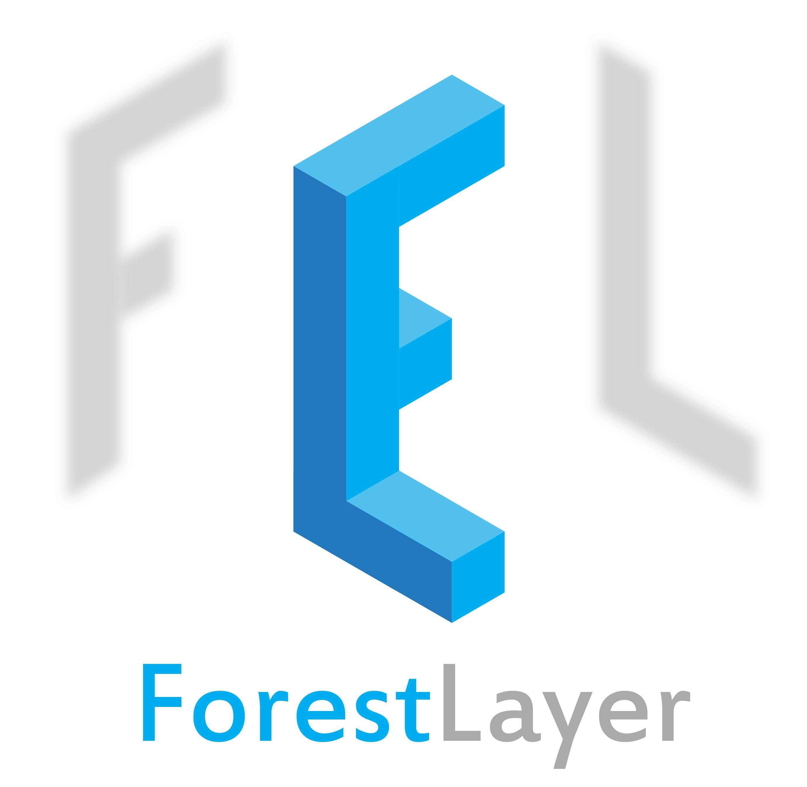

    weight="30%"
    height="18%"

.. raw:: html

   

    
   

Introduction
============

News
----

-  [10 Jan] You can now use ForestLayer for classification and
   regression task. And you can use it in your data science algorithm
   competitions! We recommend using small layer of cascade in regression
   task since it's easy to overfit the data.
-  [8 Jan] You can now use ForestLayer for classification task. See
   `examples <https://github.com/whatbeg/forestlayer/tree/master/examples>`__

Design Principles
-----------------

ForestLayer has some design principles to guide our design and
implementation.

- **Fast Deployment.** ForestLayer is composed of layers and forest estimators. The layers include multi-grain scan layer, pooling layer and auto-growing cascade layer, etc. Forest estimators include random forest, extremely(completely) random forest, gradient-boosting tree and xgboost, we consider adding LightGBM later. With these simple layer and estimators, you can feel free to build your model, then deploy it to the production environment, make it for data science competitions, or for other purposes rapidly.

- **Fast Running.** ForestLayer uses Ray, an emerging flexible and high-performance distributed execution framework based on dynamic computation graph, which supports fast scheduling and simple task-level parallelism. So with the high degree of parallelism, you can get the result several times faster than before.

- **Scalability.** ForestLayer achieves high scalability with Ray, you can add more machines(nodes) or use better equipment to gain higher efficiency.

- **Modularity.** In ForestLayer, a model, or a graph is composed of a sequence of standalone, fully-configurable modules, which is called layers, that can be combined together with as little restrictions as possible. Since we told above, multi-grain scan layers, pooling layers, concat layers and two kinds of cascade layers are all standalone modules that you can plug together to build a custom-made model.

- **User Friendliness.** Last but not least, ForestLayer follows the Keras' interfaces, Keras is a high-level neural networks API that is very simple to use and user-friendly and has a large number of users all over the world. With the Keras-like API, you can easily build the deep forest model according to your knowledge, with minimum learning cost.

Contributions
-------------

Citation
--------

If you find it is useful, please cite our project in your project and
paper.

::

    @misc{qiuhu2018forestlayer,
      title={ForestLayer},
      author={Hu, Qiu and others},
      year={2018},
      publisher={GitHub},
      howpublished={\url{https://github.com/whatbeg/forestlayer}},
    }

License
-------

ForestLayer is released under the Apache 2.0 license.

TODO
----

-  [ ] Distributed training
-  [ ] Add model save and load mechanism
-  [x] model.summary() (experiment)
-  [x] Benchmarks (Part of it)
-  [x] Documents
-  [x] Different input data load and management
-  [x] Regression task support
-  [x] Add XGBoost classifier support

